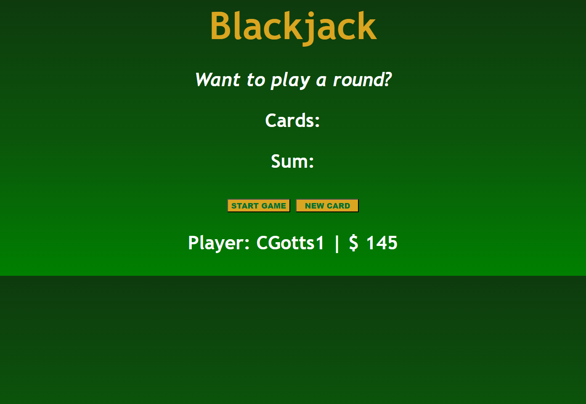

# Black-Jack

## <section id = "License">License</section>
N/A

## <section id = "Description">Description</section>
This Black Jack game was built using HTML, CSS, and JavaScript and provides a fun and interactive way to play the classic card game. To play, simply click the "Start Game" button to receive your first two cards. You can then choose to "New Card" and receive another card. The goal of the game is to get as close to 21 points as possible without going over. This Black Jack game was made possible thanks to the tutorial provided by PEr Herald Borgen on the freecodecamp.org YouTube channel. I am grateful for his clear and concise instructions, which made it possible for me to create this fun and engaging game. Enjoy the game and good luck!

Link to heroku application: https://cgotts1.github.io/Black-Jack/ 

## Table of Contents
1.) <a href = "#License">License</a> 
2.) <a href = "#Description">Description</a> 
3.) <a href = "#Installation">Installation</a>  
4.) <a href = "#Usage">Usage</a> 
5.) <a href = "#Contributing">Contributing</a> 
6.) <a href = "#Tests">Tests</a> 
7.) <a href = "#Questions">Questions</a>

## <section id = "Installation">Installation</section>
Command to Install Dependencies: N/A

## <section id = "Usage">Usage</section>
Using the Repo: N/A 

## <section id = "Contributing">Contributing</section>
Contributing to the Repo: Currently not taking contributions.

## <section id = "Tests">Tests</section>
Command to Run Tests: N/A

## <section id = "Questions">Questions</section>
If you have any questions, please feel free to contact me:   
1.) Github Username: Cgotts1  
2.) Email Address: cobi.gottschalk@gmail.com
